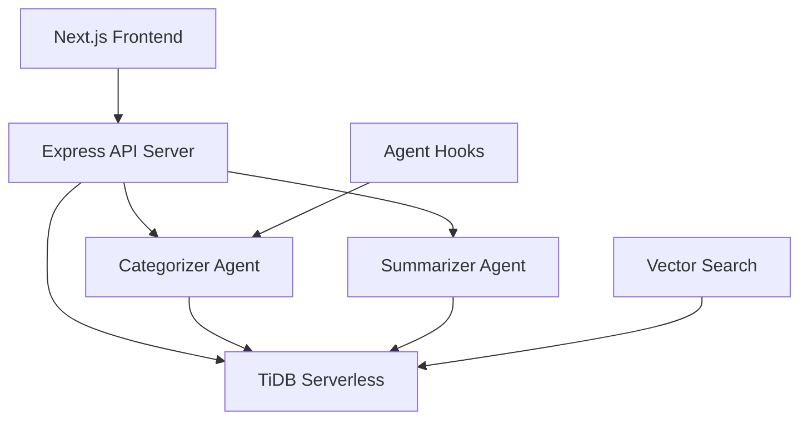

# SmartGov Assistant Design Document

## Overview

The SmartGov Assistant is a full-stack application built with Next.js frontend, Node.js/Express backend, and TiDB Serverless database. The system processes citizen feedback through two AI agents: a Categorizer Agent for real-time classification and a Summarizer Agent for trend analysis. The architecture emphasizes automation, scalability, and real-time insights.

## Architecture

### High-Level Architecture



### Technology Stack

- **Frontend**: Next.js 14 with App Router, React 18, Tailwind CSS
- **Backend**: Node.js with Express.js
- **Database**: TiDB Serverless (MySQL-compatible with vector search)
- **AI Processing**: Custom agents using OpenAI API or similar
- **Automation**: Kiro Agent Hooks
- **Styling**: Tailwind CSS with responsive design

## Components and Interfaces

### Frontend Components

#### 1. Dashboard Layout (`app/dashboard/layout.tsx`)
- Main navigation and layout structure
- Responsive sidebar with navigation links
- Header with search functionality

#### 2. Feedback Table Component (`components/FeedbackTable.tsx`)
- Displays paginated feedback with columns: text, category, sentiment, timestamp
- Sortable columns and row selection
- Real-time updates when new feedback arrives

#### 3. Summary Panel Component (`components/SummaryPanel.tsx`)
- Displays categorized insights and trends
- Visual charts for sentiment distribution
- Key metrics and emerging issues

#### 4. Search Component (`components/SearchBar.tsx`)
- Vector search input with autocomplete
- Search results display with relevance scoring
- Search history and saved searches

#### 5. Feedback Submission Form (`components/FeedbackForm.tsx`)
- Text area for feedback input
- Category selection (optional)
- Submission confirmation and error handling

### Backend API Endpoints

#### 1. Feedback Management
```typescript
POST /api/feedback
- Body: { text: string, category?: string }
- Response: { id: string, status: 'success' | 'error' }

GET /api/feedback
- Query: { page?: number, limit?: number, category?: string }
- Response: { feedback: Feedback[], total: number, page: number }

GET /api/feedback/search
- Query: { q: string, limit?: number }
- Response: { results: Feedback[], relevanceScores: number[] }
```

#### 2. Summary and Analytics
```typescript
GET /api/summary
- Response: { 
    categories: CategorySummary[], 
    trends: Trend[], 
    lastUpdated: string 
  }

GET /api/analytics
- Response: {
    totalFeedback: number,
    sentimentDistribution: SentimentStats,
    categoryDistribution: CategoryStats
  }
```

### Agent Interfaces

#### 1. Categorizer Agent
```typescript
interface CategorizerAgent {
  categorize(text: string): Promise<{
    category: 'health' | 'infrastructure' | 'safety' | 'other';
    sentiment: number; // -1 to 1 scale
    confidence: number; // 0 to 1 scale
  }>;
}
```

#### 2. Summarizer Agent
```typescript
interface SummarizerAgent {
  summarize(feedback: Feedback[]): Promise<{
    categoryInsights: CategoryInsight[];
    emergingTrends: Trend[];
    keyComplaints: string[];
    recommendations: string[];
  }>;
}
```

## Data Models

### Database Schema

#### Feedback Table
```sql
CREATE TABLE feedback (
  id VARCHAR(36) PRIMARY KEY,
  text TEXT NOT NULL,
  category ENUM('health', 'infrastructure', 'safety', 'other') DEFAULT 'other',
  sentiment DECIMAL(3,2) DEFAULT 0.00, -- -1.00 to 1.00
  confidence DECIMAL(3,2) DEFAULT 0.00, -- 0.00 to 1.00
  timestamp TIMESTAMP DEFAULT CURRENT_TIMESTAMP,
  processed BOOLEAN DEFAULT FALSE,
  vector_embedding JSON, -- For vector search
  INDEX idx_category (category),
  INDEX idx_timestamp (timestamp),
  INDEX idx_sentiment (sentiment)
);
```

#### Summary Cache Table
```sql
CREATE TABLE summary_cache (
  id VARCHAR(36) PRIMARY KEY,
  category VARCHAR(50),
  summary_data JSON,
  created_at TIMESTAMP DEFAULT CURRENT_TIMESTAMP,
  expires_at TIMESTAMP,
  INDEX idx_category (category),
  INDEX idx_created_at (created_at)
);
```

### TypeScript Interfaces

```typescript
interface Feedback {
  id: string;
  text: string;
  category: 'health' | 'infrastructure' | 'safety' | 'other';
  sentiment: number;
  confidence: number;
  timestamp: Date;
  processed: boolean;
}

interface CategorySummary {
  category: string;
  count: number;
  averageSentiment: number;
  keyIssues: string[];
  trends: string[];
}

interface Trend {
  topic: string;
  frequency: number;
  sentimentChange: number;
  timeframe: string;
}
```

## Error Handling

### Frontend Error Handling
- Global error boundary for React components
- Toast notifications for user feedback
- Retry mechanisms for failed API calls
- Graceful degradation when services are unavailable

### Backend Error Handling
- Centralized error middleware for Express
- Structured error responses with error codes
- Database connection retry logic
- Agent processing failure recovery

### Agent Error Handling
- Retry logic with exponential backoff
- Fallback to default categorization when AI fails
- Error logging and monitoring
- Circuit breaker pattern for external API calls

## Testing Strategy

### Unit Testing
- **Frontend**: Jest + React Testing Library for component testing
- **Backend**: Jest for API endpoint testing
- **Agents**: Mock AI responses for consistent testing
- **Database**: In-memory database for isolated tests

### Integration Testing
- API endpoint integration with database
- Agent processing workflows
- Frontend-backend communication
- Database query performance testing

### End-to-End Testing
- User feedback submission flow
- Dashboard data display and updates
- Search functionality
- Agent hook automation

### Performance Testing
- Database query optimization
- API response time benchmarks
- Frontend rendering performance
- Vector search performance testing

## Security Considerations

### Data Protection
- Input validation and sanitization
- SQL injection prevention using parameterized queries
- XSS protection with proper output encoding
- Rate limiting on API endpoints

### Authentication & Authorization
- API key authentication for agent hooks
- Session management for dashboard access
- Role-based access control for different user types
- Secure database connection with SSL

### Privacy
- Anonymization options for sensitive feedback
- Data retention policies
- GDPR compliance considerations
- Audit logging for data access

## Deployment and Scalability

### Infrastructure
- Containerized deployment with Docker
- Environment-based configuration
- Database connection pooling
- Horizontal scaling capabilities

### Monitoring
- Application performance monitoring
- Database query monitoring
- Agent processing metrics
- Error tracking and alerting

### Caching Strategy
- Summary data caching in database
- API response caching with Redis (optional)
- Frontend state management with React Query
- Vector embedding caching for search optimization